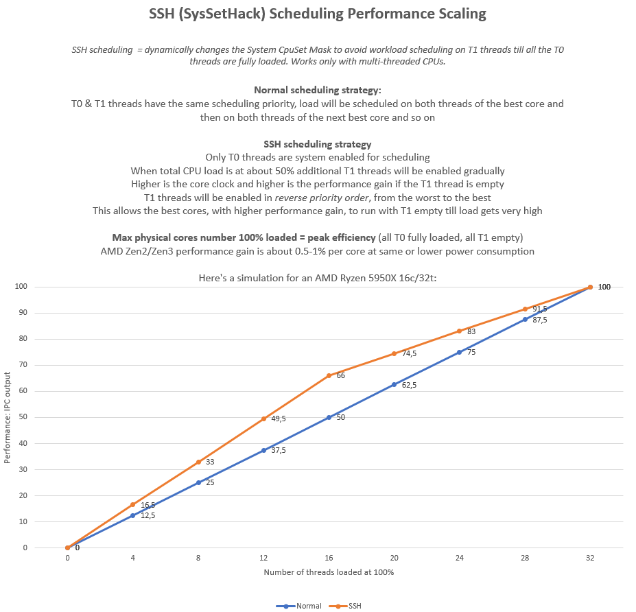



# CPUDoc

---

Here a break-down of the main features

## SysSetHack (aka SSH)

This feature will dynamically allocate the T1 threads, avoiding any scheduler allocation when not needed.
This will improve the performances substantially when the workload doesn't need the 2nd CPU threads.

You can test with 7-Zip benchmark using half or less the total CPU threads, minus 2. So use 6 threads for a 8C/16T CPU.
The results is similar to disabling SMT/HyperThreading in BIOS but you can still enjoy almost full performances when needed.
More cores are available on the CPU and more benefits can be expected running it.

In general most of the benchmarks are scoring very slightly lower or higher.
Benchmarks are mostly testing single core and full core loads while SSH ideal target for improvement is half load.
The drawback is a little lag when a very high workload needs all the cores; many synthetic MT benchmarks will score a little lower due to that.
The gap it's hardly noticeable in real world usage.

Gaming can be faster by 2-3fps to 10-20fps or more for games that are CPU limited.
SotTR (Shadow of the Tomb Raider), Assassin's Creed Valhalla, and F1 2022 are among the best games, with non GPU bound quality settings, to test for performance improvements.

Best experience should be with enough graphical settings high enough to be GPU bounding and limit the max game CPU usage to the T0 threads without T1 threads enabled.
You can monitor the CPU usage with RivaTuner or CapframeX.

7-Zip compression/decompression benchmark scores increased from 139.3/127.1 to 142.3/131 GIPS.
A modest increase cause there are not many background processes spread by the Windows scheduler all around.
On my main bloated Windows install where I have the world and beyond running in background the picture is different.
The benchmark scores increased from 129.6/122.9 to 137.3/130 GIPS.
On my 3800X with 6 threads from 46.3/44.9 to 49.1/48.3.

It's a 5-7% CPU performance increasing without actually overclocking anything.
Disabling in BIOS the T1 threads is not mandatory, avoiding that Windows allocates workload there is good enough to recover the lost performances in the T0 threads.
Intel seems to manage better with HyperThreading and the performance increase is more in the 2-3% range.

3DMark CPU Profile shows an improvement of almost 15% on my 5950X in the test for 16 core.
There's a gain in performances per core which is about 0.8-1%.
More cores the processor has and better the cumulative gain can be.
When the load is close to the number of physical cores the performance uplift is bigger and goes downward toward full cores, T0 & T1, usage.
This is particularly effective in games which already tend to use only the T0 cores, average performance uplift is about 5-10%.

There are side effects in manipulating the CpuSet System Mask.
One of these is that the background threads gets much less priority than the usual.

CapframeX can be used for benchmarking but it's not lightweight and will reduce the framerate and CPUDoc effectiveness.
It's best to check the in-game benchmark statistics if available.

The adjusted priorities work really well in keeping the gameplay as smooth as possible.
Even if there's a sudden background thread hammering the CPU, eg. Epic Games is starting an update.
In these conditions in F1 22 very often the FPS drop went down to few frames instead of 30-50 less over 130fps.

You can check yourself, both with in-game benches and CapframeX, that usually there's a big improvement in low fps scores, especially percentiles like P95 etc.

---

## PowerSaverActive (aka PSA)

The PowerSaverActive mode will install a custom dynamic power plan.
The plan settings will be adapted on the fly.

There is a **Light and** a **Deep Sleep** mode; Deep mode will have a little more performance penalty but increase a little power consumption savings, depends on the platform.

There are 3 **Performance Bias** which are adjusting in real-time the power and performance settings of the dynamic power plan:
- **Booster** - similar to Ultimate power plan, active when high cpu load is detected
- **Standard** - similar to Balanced/High Performance, active when load is average
- **Economizer** - Very low power consumption, when the load is very low or the system is idling

The Performance Bias will be dynamically set based on CPU Load and User Activity (Active Mode or Game Mode)

**Active mode** is when the System detects user activity; moving the mouse or typing on the keyboard.
This will disable all Sleep modes.

**Game Mode** will be active based on various inputs from the Windows APIs.
Sleep modes will be disabled and the min Performance Bias set to Standard.

Active and Game Modes lowest Power Bias can be customized.

There are the following sources for now to detect User Activity:
- FocusAssist; only Win10 and above, you can set it manually via the notifications panel. Alarms and Priority will enable Game Mode.
- UserNotification; only Win10 (also the older builds) and above, Busy or D3D mode will enable Game Mode.
- ForegroundWindow; this method should work regardless of Windows version. If the foreground window is full-screen it will trigger User Activity.

You can decide to enable or disable Game Mode; many activities (including watching Netflix) will be detected as Gaming.
By default it will be enabled.

There is also a specific setting for ForegroundWindow on secondary screens (Detect Game Mode on secondary monitors).
Normally anything running in full screen will trigger User Activity via FocusAssist or UserNotification and therefore Game Mode but only on the primary screen.
With this setting you can change the default behavior.
It can be useful but as default is disabled; this allows Sleep modes if you eg. keep a TV or movie running on the 2nd screen.

You can decide also the lowest Power Bias to use when in Game Mode and Active Mode.

The new **Power Tweak** setting is available with 3 modes: **LowPower**, **AutoPower**, **HighPower**.
You can use it to skew the settings and behavior toward a more conservative or aggressive power consumption.

The dynamic Power Plan is now available also with two different personalities, Balanced and Ultimate.

The power plan personality will be changed automatically based on the Power Tweak setup; LowPower will always use the Balanced personalty, while AutoPower will use it on Windows 10 and switch to Ultimate for Windows 11.
LowPower will always use the Balanced and HighPower always the Ultimate.

You can also force the personality and override the Power Tweak decision.

The timeouts and thresholds will be fully configurable.
At this time they are static.

The dynamic power plan can be reset by removing it when CPUDoc is not running.
At the next start CPUDoc will reinstall it from its folder.

Please not that if you want setup standby for the monitor and the system you need to do so while CPUDoc is running.
Right now there's no configuration for it in CPUDoc but it's also not manipulating these settings, you can customize them via Windows settings.

---

## ZenControl

This feature is specific to AMD Zen CPUs.
It will allow to set static/dynamic settings via SMU or MSR programming.

Right now it works in conjunction with PSA to adjust in real-time the PBO Limits.
It does provide a, rough for now, basic algorithm to pick PBO Limits based on CPU physical cores.
You can disable the Auto selection and specify manual limits.

WARNING: This feature is experimental and if another software is conflicting could leave your CPU with very low performance limits, needing a CPUDoc restart to recover.

---

## CoreControl

This feature is specific to Intel CPUs.
It will allow to set static/dynamic settings via MSR programming.

Right now it works in conjunction with PSA to adjust in real-time the Turbo Boost mode.
You can decide to enable Turbo mode only when user activity is detected or only with GameMode.

---

## NumaZero  (aka N0 or NZ)

This feature can be enabled with an Auto Type mode or manually selecting a fixed amount of cores to select from the first.
With NumaZero enabled only a subset of the total cores are used and can be used together with SysSetHack.

In Auto type mode only the cores in the first CCD for AMD or Cluster for Intel will be enabled.
If only one CCD/Cluster is available an Auto selection is implemented and only half of the cores selected up to 12.
You can manually specify how many Clusters to select from the first.

You can also define an exclusion for T1 threads and E-Cores or both.

This could help eg. AMD 5000/7000 with dual CCD and Alder/Raptor/Arrow Lake with Clusters/E-Cores when some specific software/game is slower than expected.

You could still see load on the disabled cores/threads. 
This is as expected as processes that are already running there could disregard the "hint" and decide to keep using the disabled cores.
The E-Cores will be parked therefore no load should be seen there once they are disabled.

---

### Command line arguments

There are a few command line arguments that can be used  when starting CPUDoc:

- LogTrace:
  - When set to 1 will enable the TraceLog, overriding but not overwriting the value in Settings
- inpoutdlldisable:
  - When set to 1 will disable the inpoutx64.dll loading at startup, overriding but not overwriting the value in Settings

### Configurations files

The App settings and Configuration files are now in a text readable INI format in the Settings folder.

*Take caution not to open the INI files in an editor and run CPUDoc at the same time, it'll likely crash*

You can freely modify the settings and configurations when the App is closed but the sensitization is still very weak. 
Configuring something with a value in an unsupported range will likely have unexpected results.